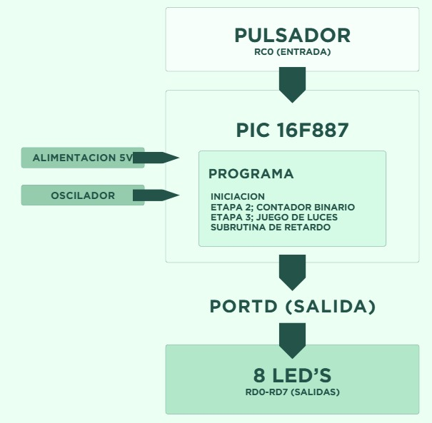
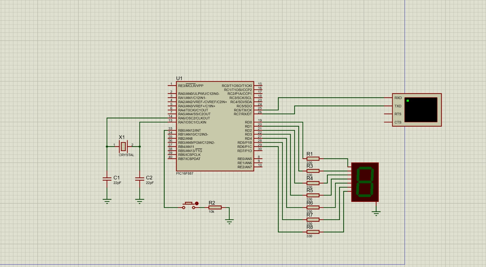
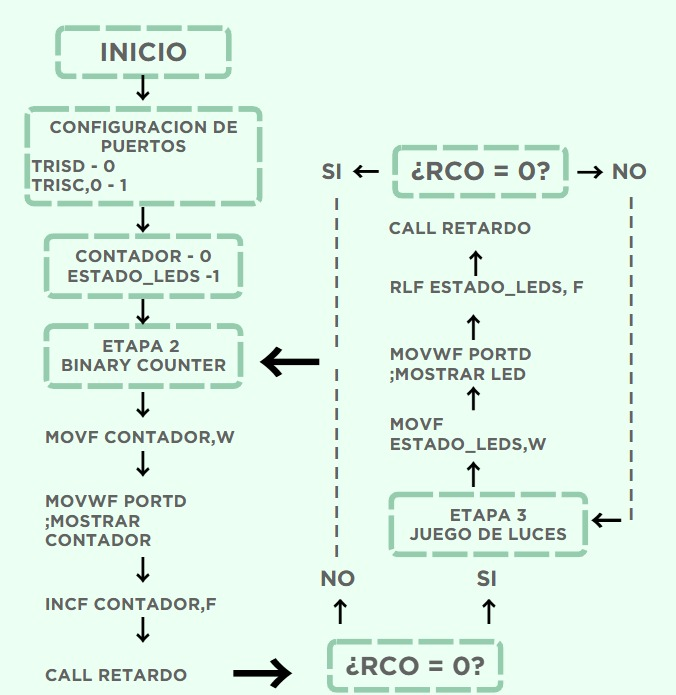

<h1 align="center"> TRABAJO PRÁCTICO N°3 ELECTRÓNICA DIGITAL II </h1>

<h1 align="center"> Contador Hexadecimal de 7 Segmentos con Control de Estado </h1>

> **Asignatura:** Electrónica Digital II - FCEFyN  
> **Integrantes (Grupo 09):**  
> - Belloso Rossi Rodrigo  
> - Curtino Velaz Santiago  
> - Guevara Lucas Daniel  
> - Ibarra Giovani Emmanuel  
> - Soto Debesa Trinidad Zoe  
>  
> **Docente:** Ing. Marcos J. Blasco.

# Índice

- [Descripción del proyecto](#descripción-del-proyecto)
- [Estructura del repositorio](#estructura-del-repositorio)
- [Alcance del proyecto (Historias de Usuario)](#alcance-del-proyecto-historias-de-usuario)
- [Arquitectura del sistema: hardware y software](#arquitectura-del-sistema-hardware-y-software)
  - [Diagrama de bloques](#diagrama-de-bloques)
  - [Esquemático del circuito](#esquemático-del-circuito)
  - [Diagrama de flujo](#diagrama-de-flujo)
- [Definición de Terminado (DoD)](#definición-de-terminado-dod)
- [Instrucciones de Simulación](#instrucciones-de-simulación)

## Descripción del proyecto

El presente proyecto consiste en el diseño e implementación de un contador hexadecimal interactivo basado en el microcontrolador PIC16F887. El sistema muestra una secuencia de caracteres hexadecimales (0 al F) a través de un display de 7 segmentos y permite al usuario controlar el flujo del conteo mediante un pulsador físico. Todo el firmware ha sido desarrollado íntegramente en lenguaje Ensamblador (ASM).

## Estructura del repositorio

El proyecto se encuentra organizado de la siguiente manera:

- 📄 `README.md`: Descripción del trabajo práctico, historias de usuario y funcionamiento del sistema (este archivo).
- 📁 `src/`: Carpeta que contiene el código fuente escrito en Ensamblador (`.asm`).
- 📁 `proteus/`: Carpeta con los archivos correspondientes a la simulación del circuito.
- 📁 `diagramas/`: Directorio destinado a las imágenes de diagramas de flujo, bloques y esquemáticos.
- ⚙️ `main.hex`: Archivo ejecutable generado tras la compilación, listo para ser cargado en el microcontrolador o en la simulación de Proteus.

## Alcance del proyecto (Historias de Usuario)

El sistema está diseñado para cumplir con las siguientes funcionalidades principales:

**1. Visualización y Conteo Hexadecimal:**
- El display proyecta de forma ordenada y continua la secuencia: 0, 1, 2, 3, 4, 5, 6, 7, 8, 9, A, B, C, D, E, F.
- **Límite Ascendente:** Al superarse el valor F, el contador se reinicia automáticamente en 0.
- **Límite Descendente:** Al decrementarse por debajo de 0, el contador salta automáticamente al valor F.
- El tiempo de permanencia de cada dígito en pantalla es de aproximadamente 1 segundo, controlado mediante subrutinas de retardo por software anidadas.

**2. Control de Sentido y Pausa:**
El sistema cuenta con un pulsador (mapeado en el pin RB0) que altera el comportamiento del contador cíclicamente mediante la lectura por sondeo (polling):
- **Estado Inicial:** Conteo automático en sentido Ascendente.
- **Pulsación 1 (Pausa):** El contador se detiene y congela el último valor en pantalla.
- **Pulsación 2 (Decremento):** El conteo se reanuda a partir del dígito congelado, pero en sentido Descendente.
- **Pulsación 3 (Pausa):** El contador se vuelve a detener.
- **Pulsación 4 (Ascendente):** Retoma el conteo en sentido Ascendente.
- Se incorporó una subrutina de retardo por software (20-30 ms) que funciona como filtro antirrebote tras detectar el cambio en RB0, evitando cambios de estado no deseados.

## Arquitectura del sistema: hardware y software

- **Microcontrolador:** PIC16F887.
- **Lenguaje:** Ensamblador (ASM).
- **Manejo de Memoria:** La decodificación del display de 7 segmentos se realiza mediante una tabla de memoria utilizando la instrucción `addwf PCL, F`, garantizando un retorno seguro sin desbordamientos con `retlw`.
- **Entradas:** El pin RB0 está configurado como entrada digital pura con resistencia de pull-down (10 kΩ). Se configuraron los registros `ANSEL` y `ANSELH` para deshabilitar las funciones analógicas y aislar la lectura del botón.
- **Salidas:** El display de 7 segmentos se encuentra mapeado al **Puerto D** (pines RD0 a RD7) con resistencias limitadoras de corriente de 330 Ω por cada segmento.

### Diagrama de bloques

  

<i>Diagrama de bloques general del sistema.</i>

### Esquemático del circuito

  

<i>Diseño del circuito en Proteus con PIC16F887, display en Puerto D y pulsador en RB0.</i>

### Diagrama de flujo

  

<i>Diagrama de flujo de la lógica de control y estados del programa.</i>

## Definición de Terminado (DoD)

El proyecto cumple con los estándares de calidad estipulados por la cátedra:
- Código fuente escrito 100% en Ensamblador (`.asm`), compilando sin errores ni warnings para la generación del ejecutable `.hex`.
- Cumplimiento estricto de la secuencia de estados mediante el uso de `btfsc` / `btfss`: Ascendente -> Pausa -> Decremento -> Pausa.
- Continuidad del conteo garantizada (al salir del estado de pausa, el conteo retoma exactamente en el último valor fijado, sin resetearse a cero).
- Aislamiento digital correcto en los pines de entrada.
- El prototipo físico (o su simulación en Proteus) responde fluidamente sin falsos disparos por rebote mecánico.

## Instrucciones de Simulación

1. Abrir el proyecto en el entorno de desarrollo y compilar el código `.asm` para generar el archivo `.hex`.
2. Abrir el esquemático del circuito en la carpeta de **Proteus**.
3. Hacer doble clic sobre el microcontrolador PIC16F887, buscar el campo `Program File` y cargar el archivo `.hex` generado.
4. Iniciar la simulación.
5. Observar el conteo inicial y utilizar el pulsador conectado en RB0 para iterar entre los estados de pausa, descenso y ascenso.
